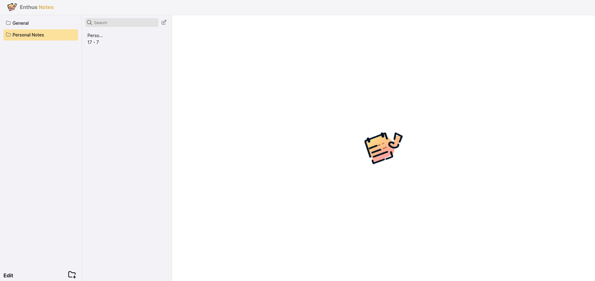

# Features Info

# Enthus Notes - A Versatile Desktop Note-Taking Application



## Introduction

Enthus Notes is a feature-rich and user-friendly desktop note-taking application designed for Linux users. Whether you need to jot down quick thoughts, create to-do lists, or organize your ideas, Enthus Notes provides a seamless and intuitive note-taking experience. The application is available in both .deb and .AppImage formats, making it accessible and easy to install on various Linux distributions.

## Key Features

1. **Simple and Intuitive Interface**: Enthus Notes boasts a clean and clutter-free interface, allowing users to focus solely on capturing their thoughts without distractions.

2. **Rich Text Formatting**: Customize your notes with various text formatting options like bold, italics, bullet points, and more, to make your notes stand out.

3. **Multiple Notebooks**: Organize your notes efficiently by creating multiple notebooks for different topics or projects.

<!-- 4. **Tags and Labels**: Categorize and sort your notes with tags and labels for easy retrieval and organization.

5. **Sync Across Devices**: Enjoy seamless synchronization of your notes across multiple devices, ensuring you can access them wherever you go.

6. **Dark Mode**: Enthus Notes offers a dark mode option for reduced eye strain during late-night note-taking sessions. -->

4. **Search Functionality**: Quickly find specific notes using the powerful search feature.

<!-- 8. **Backup and Restore**: Secure your notes with regular backups and restore them whenever needed. -->

## Download Links

You can download Enthus Notes using the following links:

1. [.deb Package](https://github.com/work4m/Enthus-note/releases/download/v0.0.1/enthus-notes_0.0.1_amd64.deb)
2. [.AppImage](https://github.com/work4m/Enthus-note/releases/download/v0.0.1/enthus-notes_0.0.1_amd64.AppImage)

## Installation

### For .deb Package

1. Download the `.deb` package from the link provided above.

2. Open a terminal and navigate to the directory where the `.deb` package is located.

3. Run the following command to install Enthus Notes:

```bash
sudo dpkg -i enthus-notes_amd64.deb
```

4. Once the installation is complete, you can launch Enthus Notes from the applications menu.

### For .AppImage

1. Download the `.AppImage` file from the link provided above.

2. Right-click on the downloaded file, go to "Properties," and navigate to the "Permissions" tab.

3. Check the box labeled "Allow executing file as program."

4. Close the properties window, and then double-click the `.AppImage` file to run Enthus Notes.

## System Requirements

- Linux OS (Various distributions supported)
- Minimum RAM: 1GB
- Disk Space: 100MB

<!-- ## Feedback and Support

For feedback, bug reports, or support requests, you can reach out to the Enthus Notes development team via email at support@enthusnotes.com or visit our [official website](https://www.enthusnotes.com/support) for further assistance. -->

## Conclusion

Enthus Notes is a powerful and versatile note-taking application that empowers Linux users to stay organized, creative, and productive. With its array of features and cross-device synchronization, it offers a seamless note-taking experience that caters to a wide range of users. Download Enthus Notes today and elevate your note-taking journey to new heights!
